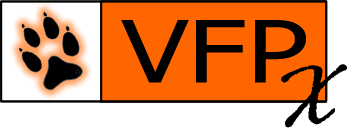

# FoxFaker 

`FoxFaker` is a Visual FoxPro Class library that generates fake data for you. If your're working using n-tier architecture, MVC, or any other technique where you isolate business logic and data acces, then you probably need to spend some time by filling your persistence data to stress test it. Here is where FoxFaker comes to the rescue.


`FoxFaker` was written with the purpose to be used with [FoxUnit](https://github.com/VFPX/FoxUnit) and [FoxMock](https://github.com/cwollenhaupt/foxmock) libraries. If you're not familiar with TDD (Test Driven Development) then you probably need to learn about it or just ignore it and use `FoxFaker` as you wish.

`FoxFaker` is heavily inspired by PHP's [Faker](https://github.com/fzaninotto/Faker).

`FoxFaker` works quite good on VFP >= 7

# Table of Contents

- [Installation](#installation)
- [Basic Usage](#basic-usage)
- [Formatters](#formatters)
	- [Base](#foxfakerproviderbase)
	- [Lorem Ipsum Text](#foxfakerproviderlorem)
	- [Person](#foxfakerprovideren_usperson)
	- [Address](#foxfakerprovideren_usaddress)
	- [Phone Number](#foxfakerprovideren_usphonenumber)
	- [Company](#foxfakerprovideren_uscompany)
	- [Date and Time](#foxfakerproviderdatetime)
	- [Internet](#foxfakerproviderinternet)
	- [Payment](#foxfakerproviderpayment)
	- [Color](#foxfakerprovidercolor)
	- [File](#foxfakerproviderfile)
	- [Uuid](#foxfakerprovideruuid)
	- [Barcode](#foxfakerproviderbarcode)
	- [Miscellaneous](#foxfakerprovidermiscellaneous)
- [License](#license)


## Installation

```
Just copy tha FoxFaker.prg and FactoryBase.txt files anywhere into your project path folder.
```

## Basic Usage

Use a **Public** Variable or a **_Screen Property** to instantiate `FoxFaker.prg` object.

```xBase
Public Faker
// require the FoxFaker Prg
Set Procedure to "FoxFaker" Additive

// Instantiate FoxFaker Object
Faker = NewObject("FoxFaker", "FoxFaker.prg")

// Generate data by accessing properties. 
// All methods are written using 'fake' as prefix
// for avoiding "Function Name" conflict, when calling Faker.name()

?Faker.fakeName() 	// 'Jhon Doe'

?Faker.fakeAddress() 	// "426 Jordy Lodge Cartwrightshire, SC 88120-6700"
?Faker.text()
  // Dolores sit sint laboriosam dolorem culpa et autem. Beatae nam sunt fugit
  // et sit et mollitia sed.
  // Fuga deserunt tempora facere magni omnis. Omnis quia temporibus laudantium
  // sit minima sint.
```
## Formatters

Each of the generator properties (like `name`, `address`, and `lorem`) are called "formatters". A faker generator has many of them, packaged in "providers". Here is a list of the bundled formatters in the default locale.

### `FoxFaker\Provider\Base`
```xBase
    fakeRandomDigit()             		// 9
    fakeRandomNumber(tnLength)  		// 16795371    
    fakeNumberBetween(tnLowVal, tnHighVal) 	// 1985
    fakeRandomLetter()          		// 'i'
```
### `FoxFaker\Provider\Lorem`
```xBase
    fakeWord()                            // 'aut'
    fakeWords(tnHowMany)                  // Laborum vero a officia id corporis.
    fakeSentence(tnHowMany)  		  // 'Sit vitae voluptas sint non voluptates.'
    fakeText(tnLength)                    // 'Fuga totam reiciendis qui architecto fugiat nemo.'
```
### `FoxFaker\Provider\en_US\Person`
```xBase
    fakeTitle(tcGender = null|'male'|'female') 	   // 'Ms.'
    fakeTitleMale()                                // 'Mr.'
    fakeTitleFemale()                              // 'Ms.'
    fakeSuffix()                                   // 'Jr.'
    fakeName(tcGender = null|'male'|'female')      // 'Dr. Zane Stroman'
    fakeFirstName(tcGender = null|'male'|'female') // 'Maynard'
    fakeFirstNameMale()                            // 'Maynard'
    fakeFirstNameFemale()                          // 'Rachel'
    fakeLastName()                                 // 'Zulauf'
```
### `FoxFaker\Provider\en_US\Address`
```xBase  
    fakeSecondaryAddress()	// 'Suite 961'
    fakeState()			// 'NewMexico'    
    fakeCity()			// 'West Judge'
    fakeStreetName()		// 'Keegan Trail'
    fakeStreetAddress()		// '439 Karley Loaf Suite 897'
    fakePostcode()		// '17916'
    fakeAddress()		// '8888 Cummings Vista Apt. 101, Susanbury, NY 95473'
    fakeCountry()		// 'Falkland Islands (Malvinas)'
    fakeLatitude()		// 77.147489
    fakeLongitude()		// 86.211205
```
### `FoxFaker\Provider\en_US\PhoneNumber`
```xBase
    fakePhoneNumber()           // '201-886-0269 x3767'
```
### `FoxFaker\Provider\en_US\Company`
```xBase
    fakeCompany()		// 'Bogan-Treutel'
    fakeJobTitle()		// 'Cashier'
```
### `FoxFaker\Provider\DateTime`
```xBase
    fakeDate()		// '1979-06-09'
    fakeTime() 		// '20:49:42'
    fakeAmPm()          // 'pm'
    fakeDayOfMonth()    // '04'
    fakeDayOfWeek()     // 'Friday'
    fakeMonth()         // '06'
    fakeMonthName()     // 'January'
    fakeYear()          // '1993'
```
### `FoxFaker\Provider\Internet`
```xBase
    fakeEmail()               // 'tkshlerin@collins.com'
    fakeSafeEmail()           // 'king.alford@example.org'
    fakeUserName()            // 'wade55'
    fakeDomain()              // 'wolffdeckow.net'
    fakeUrl()                 // 'http://www.skilesdonnelly.biz/aut-accusantium-ut-architecto-sit-et.html'
    fakeIpv4()                // '109.133.32.252'
    fakeLocalIpv4()           // '10.242.58.8'
    fakeIpv6()                // '8e65:933d:22ee:a232:f1c1:2741:1f10:117c'
    fakeMacAddress()          // '43:85:B7:08:10:CA'
```
### `FoxFaker\Provider\Payment`
```xBase
    fakeCreditCardType()          // 'MasterCard'
    fakeCreditCardNumber()        // '4485480221084675'
```
### `FoxFaker\Provider\Color`
```xBase
    fakeHexcolor()               // '#fa3cc2'
    fakeRgbcolor()               // '0,255,122'
    fakeColorName()              // 'Gainsbor'
```
### `FoxFaker\Provider\File`
```xBase
    fakeFileExtension()          // 'avi'
    fakeMimeType()               // 'video/x-msvideo'
```
### `FoxFaker\Provider\Uuid`
```xBase
    fakeUuid()                   // '7e57d004-2b97-0e7a-b45f-5387367791cd'
```
### `FoxFaker\Provider\Barcode`
```xBase
    fakeEan13()          // '4006381333931'
    fakeEan8()           // '73513537'
```
### `FoxFaker\Provider\Miscellaneous`
```xBase
    fakeBoolean() 	// .F.
    fakeMD5()           // 'de99a620c50f2990e87144735cd357e7'
    fakeSHA1()          // 'f08e7f04ca1a413807ebc47551a40a20a0b4de5c'
    fakeSHA256()        // '0061e4c60dac5c1d82db0135a42e00c89ae3a333e7c26485321f24348c7e98a5'
    fakeCountryCode()   // ES
    fakeCurrencyCode()  // EUR
```
## License

Faker is released under the MIT Licence.


